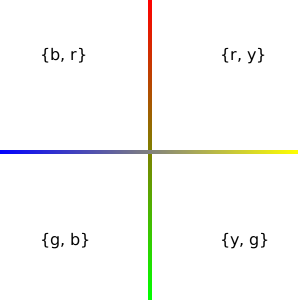

# RYGB #
RYGB color notation is a syntactical abstraction over the HSV color model. Specifically, it provides an intuitive and analogous approach to expressing hue by way of additive, proportional mixing of adjacent primary colors.

The RYGB chromatic model is based on the [opponent process color theory](https://en.wikipedia.org/wiki/Opponent_process), first theorized by physiologist Ewald Hering in 1892. This model consists of two opposing color axioms - red/green and yellow/blue.  The orthogonal arrangement of these axioms results in 4 adjacent color pairs, each a binary set:

<br>

<p align="center"></p>

&nbsp;
<br>

Any desired hue can be expressed by determining the appropriate pair, then mixing the two associated primaries in relative parts. For example, the notation `'r2y3'` results in a yellowish-orange hue that is exactly 2 parts red and 3 parts yellow.

RYGB was created for coding-centric design/development workflows. It is intended for rapid prototyping, design, animation, and scenarios when experimental color choices may happen frequently. In such cases, the repeated context-switching inherent with the use of traditional GUI color-selection tools may be both cumbersome and undesirable.

<br>

## Usage ##

In node.js (after `npm install rygb`):
```javascript
var rygb = require('rygb')
```

Equal parts blue and red will produce magenta:
```javascript
rygb('br').css()  // 'rgba(255, 0, 255, 1)'
```

Equal parts red and yellow will produce orange:
```javascript
rygb('ry').css()  // 'rgba(255, 128, 0, 1)'
```

1 part red, 2 parts yellow:
```javascript
rygb('r1y2').css()  // 'rgba(255, 170, 0, 1)'
```

3 parts red, 7 parts yellow:
```javascript
rygb('r3y7').css()  // 'rgba(255, 179, 0, 1)'
```

Order is reversible, although `'ry'`, `'yg'`, `'gb'`, and `'br'` is idiomatic.
```javascript
rygb('y7r3').css() === rygb('r3y7').css()  // true
```

When using a single part of a primary, the `1` is optional. Although its omission is idiomatic, it's inclusion is occasionally useful for readability in mixtures such as `'b23r1'`, for example:
```javascript
rygb('r1y2').css() === rygb('ry2').css()  // true

rygb('br').css() === rygb('b1r1').css()  // true

rygb('b23r1').css() === rygb('b23r').css()  // true
```

<br>
<br>

Saturation, value, and alpha are each expressed using an integer `[0-100]`, representing a percentage `[0%-100%]`. The default value for each is `100`.

3 parts red, 7 parts yellow, with 50% saturation:
```javascript
rygb('r3y7-s50').css()  // 'rgba(255, 217, 128, 1)'
```

3 parts red, 7 parts yellow, with 50% saturation and 33% value:
```javascript
rygb('r3y7-s50-v33').css()  // 'rgba(84, 72, 42, 1)'
```

3 parts red, 7 parts yellow, with 50% saturation, 33% value, and 66% alpha:
```javascript
rygb('r3y7-s50-v33-a66').css()  // 'rgba(84, 72, 42, 0.66)'
```

<br>

Primary colors can be expressed using a single character.<br>

```javascript
rygb('r').css()  // 'rgba(255, 0, 0, 1)' ← red

rygb('y').css()  // 'rgba(255, 255, 0, 1)' ← yellow

rygb('g').css()  // 'rgba(0, 255, 0, 1)' ← green

rygb('b').css()  // 'rgba(0, 0, 255, 1)' ← blue
```

<br>

White, black, and neutral grays can be expressed by limiting input to the `value` syntax.<br>

```javascript
rygb('v100').css()  // 'rgba(255, 255, 255, 1)' ← white

rygb('v0').css()  // 'rgba(0, 0, 0, 1)' ← black

rygb('v50').css()  // 'rgba(128, 128, 128, 1)' ← 50% gray
```

<br>

More examples with various colors:

```javascript
rygb('gb-s21-v83').css()  // 'rgba(167, 212, 212, 1)' ← robin's egg blue

rygb('g2b5-s31-v47').css()  // 'rgba(83, 104, 120, 1)' ← payne's gray

rygb('g21b1-s24-v88').css()  // 'rgba(171, 224, 175, 1)' ← celadon

rygb('r1y3-s80-v96').css()  // 'rgba(245, 196, 49, 1)' ← saffron

rygb('b9r4-s31').css()  // 'rgba(225, 176, 255, 1)' ← mauve

rygb('yg').css()  // 'rgba(128, 255, 0, 1) ← chartreuse

rygb('y-s6').css()  // 'rgba(130, 109, 49, 1)' ← ivory

rygb('v20').css()  // 'rgba(51, 51, 51, 1)' ← jet
```
<br>
<br>

## API ##
The `rygb` parser will accept either a string or an object literal. When passing an object, the `h` property represents the hue, and must be an object. This hue object can contain either one or two keys:
```javascript
// 'g2b5-s31-v47-a88'
rygb({h: {g: 2, b: 5}, s: 31, v: 47, a: 88})

// 'r'
rygb({h: {r: 1}})
```


### Serialization methods


`.css()` is a perhaps the most immediately useful method when using RYGB notation for rapid prototyping and design.

```javascript
rygb('yg').css()  // 'rgba(128, 255, 0, 1)'
```

<br>

The `.css()` method above is also available as `.rgba().css()`.
```javascript
rygb('yg').rgba().css()  // 'rgba(128, 255, 0, 1)'
```

<br>

To return an array of red, green, blue, and alpha values:
```javascript
rygb('yg').rgba().toArray()  // [128, 255, 0, 1]
```

<br>

Red, green, and blue values are, by default, normalized to `[0-255]` (byte). Decimal values `[0-1]` can optionally be returned :
```javascript
rygb('g2b5-s31-v47').rgba().toArray({decimal: true})  // [0.881167, 0.69, 1, 1]
```

<br>

Turn a JSON representation into RYGB string notation:
```javascript
rygb({h: {g: 2, b: 5}, s: 31, v: 47}).toString()  // 'g2b5-s31-v47'
```

<br>

Turn RYGB notation into a JSON representation:
```javascript
rygb('g2b5-s31-v47').toJSON()  // '{h: {g: 2, b: 5}, s: 31, v: 47}'
```

<br>

## Usage with other tools ##
Although color conversions and manipulations are outside the scope of this utility, `rygb` can be used to supply parsable input to other packages that provide a vast array of such functionality. Popular, well-supported JavaScript color libraries include [color](https://github.com/Qix-/color), [one-color](https://github.com/One-com/one-color), [chroma.js](https://github.com/gka/chroma.js/), and [TinyColor](https://github.com/bgrins/TinyColor).

<br>

## License ##
MIT. See LICENSE.
